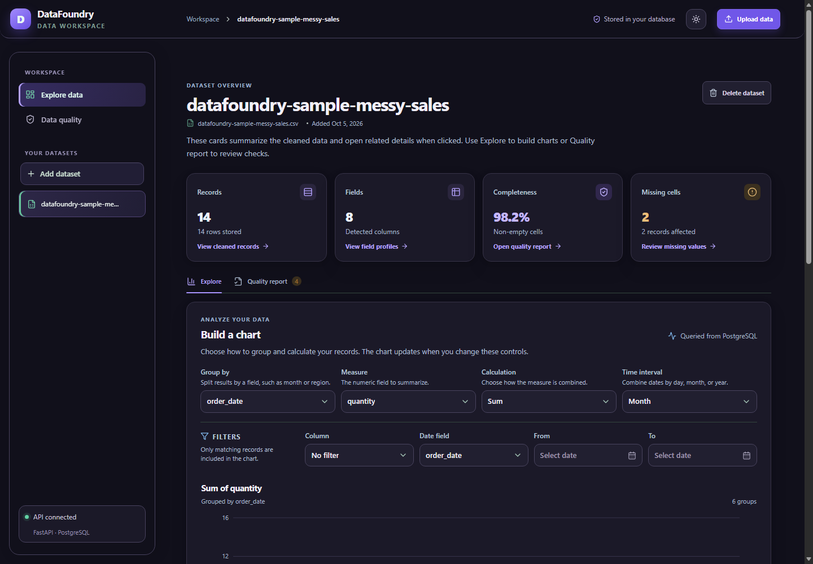

# DataFoundry

DataFoundry is an e-commerce analytics project that grew into a reusable, full-stack data workspace. Its original analysis used the Olist Brazilian E-Commerce dataset to explore sales, customers, products, payments, and delivery performance. The current app lets you upload a CSV, clean and validate it, then explore the results with PostgreSQL-backed analytics.



## Project background

The project started with questions about the Olist marketplace:

- How does revenue change over time, and what is the average order value?
- Which product categories lead in revenue and sales volume?
- How often do customers return to place another order?
- Which payment methods are most common?
- How do actual delivery dates compare with estimated dates?

The earlier multi-table analysis found that about 96.9% of customers placed one order and 3.1% placed multiple orders. Its headline metrics were:

| Metric | Original Olist analysis |
|---|---:|
| Total revenue | 16.01M |
| Total orders | 99K |
| Average order value | 160.99 |
| On-time delivery | 91.9% |

These figures describe the original Olist analysis; they are not live metrics generated by uploading one CSV to the current app.

## Dashboard

The screenshot above shows the current interactive DataFoundry app. The former Power BI report is not included. Its original multi-table analysis covered monthly revenue, category revenue and sales volume, payment methods, customer retention, and delivery performance. The current workspace accepts one CSV per upload and does not join separate Olist tables, so reproducing those findings requires doing that analysis separately.

Beauty & Health, Watches & Gifts, Bed, Bath & Table, Sports & Leisure, and Computers & Accessories were among the stronger categories by revenue in the original analysis. The highest-volume categories did not always match the highest-revenue categories. Credit cards were the most common payment method, while voucher payments had a lower average payment value. Delivery was on time or early for about 91.9% of delivered orders.

## What changed in the rewrite

This is a substantial change in direction, not just a visual refresh. The original repository was a one-off Olist analysis pipeline that produced a Power BI report. The current project is an interactive application for uploading and exploring individual CSV datasets.

| Original project | Current project |
|---|---|
| Python scripts cleaned, validated, and analyzed the Olist tables from local files. | A FastAPI backend cleans and profiles a CSV when it is uploaded; a React interface lets users review and explore it. |
| SQL schema and analysis queries were designed around the Olist relational tables. | PostgreSQL stores each uploaded dataset, its column profiles, and quality checks. The app creates its application tables at startup. |
| Analysis results were exported as report CSVs and images and presented in Power BI. | Charts, quality details, and cleaned-record previews are generated in the web app; cleaned records can be exported as CSV. |
| The workflow assumed the Olist dataset and multiple related tables. | The app works with one CSV at a time and does not automatically join separate files. |

The following original project files are no longer included in the current project tree:

- `notebooks/data_discovery.ipynb`, the Olist exploration notebook.
- `src/data/` and `src/analysis/`, including the original cleaning, validation, loading, and analysis scripts.
- `sql/schema.sql` and `sql/analysis.sql`, which defined and queried the original Olist database.
- `reports/`, including the Power BI `.pbix`, report preview, and generated analysis CSVs and charts.
- The root `requirements.txt`; Python dependencies for the current API are now in `backend/requirements.txt`.

These files were removed from the current version because their batch-processing and report workflow was replaced by the upload-driven app. The historical figures and findings above summarize the original analysis; the old notebook, report files, and multi-table analysis are not reproduced by the current app. Raw and processed dataset files are also intentionally kept out of the repository; see [Dataset and local data](#dataset-and-local-data) for the optional Olist download and current app limitations.

## Requirements

- Python 3.12 or newer
- Node.js 24 LTS (Vite requires Node 20.19+ or 22.12+; Node 24 meets that requirement)
- PostgreSQL 17 or newer

Install Python from [python.org](https://www.python.org/downloads/), Node.js from [nodejs.org](https://nodejs.org/en/download/), and PostgreSQL using the [official platform downloads](https://www.postgresql.org/download/). On macOS, [Postgres.app](https://postgresapp.com/) is another option. Linux users can use their distribution's PostgreSQL packages. Vite's current Node requirements are documented in the [Vite guide](https://vite.dev/guide/).

## Configure PostgreSQL

Start PostgreSQL and use the existing `datafoundry` database. Connect as its administrator from a terminal:

```sh
psql -U postgres -h localhost -d postgres
```

In the `psql` prompt, create the local application role, set its password, and grant it access to the existing database. The password prompt keeps it out of the SQL command history:

```sql
CREATE USER datafoundry LOGIN;
\password datafoundry
GRANT CONNECT, CREATE ON DATABASE datafoundry TO datafoundry;
\connect datafoundry
GRANT USAGE, CREATE ON SCHEMA public TO datafoundry;
\q
```

If the `datafoundry` role already exists, skip `CREATE USER` and continue with `\password` and the `GRANT` commands. The app creates its own four tables in this database and leaves existing tables and records in place.

Copy `.env.example` to `.env` and set `POSTGRES_PASSWORD` to the same password. In Windows Command Prompt:

```cmd
copy .env.example .env
```

On macOS or Linux:

```sh
cp .env.example .env
```

`.env` is ignored by Git. Keep your local password there; never put it in `.env.example` or commit `.env`.

## Install and run

Use two terminals from the project folder.

### Windows Command Prompt: API

```cmd
python -m venv .venv
.venv\Scripts\python.exe -m pip install --upgrade pip
.venv\Scripts\python.exe -m pip install -r backend\requirements.txt
.venv\Scripts\python.exe -m uvicorn --app-dir backend app.main:app --reload --host 127.0.0.1 --port 8000
```

### macOS or Linux: API

```sh
python3 -m venv .venv
.venv/bin/python -m pip install --upgrade pip
.venv/bin/python -m pip install -r backend/requirements.txt
.venv/bin/python -m uvicorn --app-dir backend app.main:app --reload --host 127.0.0.1 --port 8000
```

### All platforms: web interface

In the second terminal:

```sh
cd frontend
npm install
npm run dev
```

Open [http://localhost:5173](http://localhost:5173). FastAPI's interactive documentation is at [http://localhost:8000/docs](http://localhost:8000/docs). The API creates its tables when it starts. Vite forwards `/api` requests to the API on port 8000.

To stop the app, press `Ctrl+C` in both terminals. PostgreSQL remains a separate system service. The database stores uploaded datasets until you delete them in the workspace or remove them through the API.

## Features

- **Upload:** Import UTF-8 CSV files up to 25 MB and 500,000 rows.
- **Clean:** Trim surrounding whitespace, normalize blank and common null markers, optionally remove fully empty rows and exact duplicates, and infer date columns from their names and values.
- **Quick practice file:** Load the tiny sample directly in the upload panel or download it from the empty dashboard. It contains extra spaces, a repeated row, a blank row, a missing amount, and an invalid date so you can see which issues the selected cleaning options handle and which ones the report flags.
- **Validate:** Open the Data quality section before upload to see what it checks. After upload, review missing values, duplicate and empty rows, date parsing, completeness, unique counts, inferred types, and sample values.
- **Inspect checks:** Select a quality check card to open field-level missing/date details or counts for duplicate and blank rows removed.
- **Explore:** Group columns and calculate sum, average, minimum, maximum, or record count. Filter by an exact field value or date range, and choose a time interval for date trends.
- **Review records:** Browse cleaned rows in pages and delete datasets.
- **Dashboard shortcuts:** Click Records, Fields, Completeness, or Missing cells to jump to the matching table or quality report section.
- **CSV export:** Download any cleaned dataset as a CSV directly from the preview panel for sharing or downstream analysis.
- **Preview search:** Filter the current cleaned-record table by text values without leaving the dashboard.
- **Responsive themes:** Use the light or dark theme. The device preference sets the initial theme unless a theme was previously saved in the browser. Both themes use the violet brand palette and adapt to desktop, tablet, and mobile widths.

The completeness score is the percentage of non-empty cells after the selected cleaning steps. Automatic date parsing is limited to fields whose names suggest date or time values.

Each uploaded CSV is analyzed as a separate dataset. The current dashboard does not join multiple CSVs or fill in partially missing values; it reports those values for review.

The uploaded original CSV is processed by the API and is not retained as a file. PostgreSQL stores the cleaned records and report data. Export cleaned records from **Data preview** when you need a CSV copy.

## Try the dashboard

1. Start PostgreSQL, the API, and the frontend using the instructions above.
2. Choose **Upload data** and select **Load quick practice CSV** to try the built-in sample without downloading a dataset.
3. Leave the cleaning options enabled and choose **Upload and analyze**. The 16 sample rows become 14 cleaned rows: one blank row and one duplicate are removed, and surrounding spaces are trimmed. The missing amount and invalid date remain visible for review.
4. Open **Quality report** to inspect the findings, then return to **Explore** to build a chart. For the sample, group by `order_date`, measure `total_sales`, choose **Sum**, and select **Month**.
5. Search or page through **Data preview**, export the cleaned CSV, or delete the test dataset when finished.

## Dataset and local data

The [Brazilian E-Commerce Public Dataset by Olist](https://www.kaggle.com/datasets/olistbr/brazilian-ecommerce) is optional and is not included in this repository. Download it from Kaggle and extract it locally if you want to explore its CSVs; Kaggle may require an account.

The app accepts one CSV per upload (up to 25 MB and 500,000 rows). Select an individual downloaded CSV in the upload dialog; datasets are not automatically joined. Raw and processed data are deliberately excluded from Git: `data/raw/` and `data/processed/` are ignored, and the built-in practice CSV is enough to try the app. The app cleans files during upload, stores cleaned records and quality results in PostgreSQL, and can export cleaned records through **Export CSV**.

The API is versioned under `/api/v1`. This setup is intended for local development; configure credentials, CORS, upload limits, and deployment settings before exposing it beyond your machine.

## Project structure

```text
DataFoundry/
├── backend/
│   ├── app/
│   │   ├── api.py
│   │   ├── database.py
│   │   ├── main.py
│   │   ├── models.py
│   │   └── services/pipeline.py
│   └── requirements.txt
├── frontend/
│   ├── public/
│   └── src/
├── data/                  # Local-only raw and processed data
├── .env.example
├── dashboard.png
└── README.md
```

## What I learned

Building the original analysis and the current workspace brought together data cleaning, relational data modeling, SQL aggregation, customer and product analysis, data validation, and dashboard design. It also highlighted the difference between a multi-table business analysis and a reusable tool that currently explores one uploaded dataset at a time.
