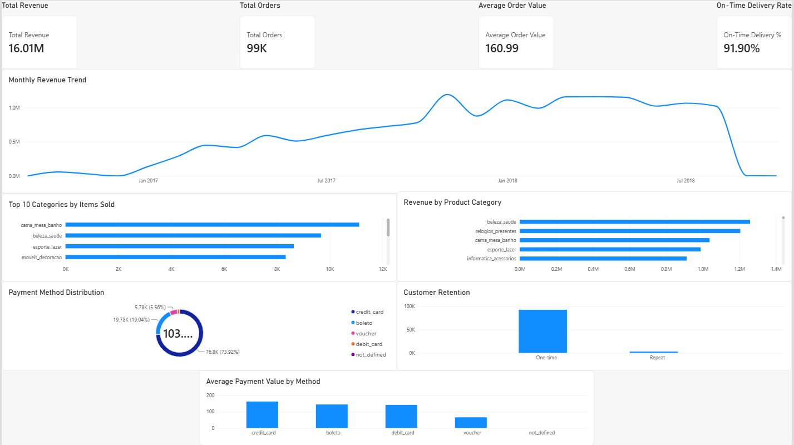

# DataFoundry

A hands-on e-commerce data analytics project built using Python, PostgreSQL, SQL, and Power BI.

## About

I built DataFoundry using the Olist Brazilian E-Commerce dataset to work through a complete analytics workflow, from cleaning the raw data to building a final Power BI dashboard.

I used Python and Pandas for data cleaning and analysis, PostgreSQL for storing and querying the data, and Power BI for the final visualization and reporting.

The project focuses on sales, customers, products, payments, and delivery performance.

## What I Looked At

Some of the questions I wanted to answer were:

- How does revenue change over time?
- What is the average order value?
- Which product categories generate the most revenue?
- Which categories sell the most items?
- How many customers actually come back and purchase again?
- Which payment methods are most commonly used?
- How well are orders being delivered compared with their estimated delivery dates?

## Dashboard

The final analysis was put together in Power BI.



### Main metrics

| Metric | Value |
|---|---:|
| Total Revenue | 16.01M |
| Total Orders | 99K |
| Average Order Value | 160.99 |
| On-Time Delivery | 91.90% |

The dashboard includes:

- Monthly revenue trend
- Revenue by product category
- Top categories by items sold
- Payment method distribution
- Customer retention
- Average payment value by method

The Power BI file is available in:

`reports/DataFoundry_Dashboard.pbix`

## A Few Findings

### Customer retention

One of the more interesting results was how few customers returned.

Around 96.9% of customers placed only one order, while roughly 3.1% placed more than one order.

Repeat customers also generated considerably more revenue per customer on average. This makes customer retention one of the more interesting areas to look at from a business perspective.

### Products

Beauty & Health, Watches & Gifts, Bed, Bath & Table, Sports & Leisure, and Computers & Accessories were among the strongest categories by revenue.

The categories with the highest number of items sold were not always the same categories generating the most revenue, which was useful to see when comparing volume with value.

### Payments

Credit cards were by far the most common payment method and also accounted for the largest share of payment value.

Voucher payments had a much lower average payment value than the other major payment methods.

### Delivery

About 91.9% of delivered orders arrived on or before the estimated delivery date.

That is a good overall result, although the remaining late orders still represent an area where delivery performance could be improved.

## How I Built It

The project follows this workflow:

```text
Raw CSV files
      ↓
Python data cleaning
      ↓
Processed datasets
      ↓
PostgreSQL
      ↓
SQL analysis
      ↓
Python analysis
      ↓
Power BI dashboard
```

### Python

The Python scripts handle the data preparation and analysis.

`src/data/`

- `clean_data.py` — cleans and transforms the raw datasets
- `validate_processed.py` — checks processed files and row counts
- `check_keys.py` — checks primary and composite keys
- `load_to_postgres.py` — loads the processed data into PostgreSQL

`src/analysis/`

- `sales_analysis.py` — monthly sales and revenue analysis
- `customer_analysis.py` — customer and revenue analysis
- `product_analysis.py` — product category analysis

### PostgreSQL and SQL

The database structure is defined in:

`sql/schema.sql`

The business analysis queries are in:

`sql/analysis.sql`

The database contains tables for customers, orders, order items, products, sellers, payments, reviews, and geolocation.

### Power BI

Power BI is used for the final dashboard and combines the main business metrics into a single interactive report.

## Project Structure

```text
DataFoundry/
├── data/
│   ├── raw/
│   └── processed/
├── notebooks/
│   └── 01_data_discovery.ipynb
├── reports/
│   ├── monthly_sales.csv
│   ├── monthly_revenue.png
│   ├── customer_summary.csv
│   ├── customer_revenue.csv
│   ├── customer_types.png
│   ├── category_analysis.csv
│   ├── top_categories_by_volume.csv
│   ├── high_value_categories.csv
│   ├── category_revenue.png
│   ├── category_volume.png
│   └── DataFoundry_Dashboard.pbix
├── sql/
│   ├── schema.sql
│   └── analysis.sql
├── src/
│   ├── analysis/
│   │   ├── sales_analysis.py
│   │   ├── customer_analysis.py
│   │   └── product_analysis.py
│   └── data/
│       ├── check_keys.py
│       ├── clean_data.py
│       ├── load_to_postgres.py
│       └── validate_processed.py
├── .gitignore
├── README.md
└── requirements.txt
```

## Running It

Create a virtual environment and install the dependencies:

```bash
python -m venv .venv
pip install -r requirements.txt
```

Process the raw data:

```bash
python src\data\clean_data.py
```

Validate the processed datasets:

```bash
python src\data\validate_processed.py
```

Create the PostgreSQL database, run `sql/schema.sql`, and then load the processed data:

```bash
python src\data\load_to_postgres.py
```

Run the analysis scripts:

```bash
python src\analysis\sales_analysis.py
python src\analysis\customer_analysis.py
python src\analysis\product_analysis.py
```

The generated reports will be placed in `reports/`.

## Dataset

This project uses the Olist Brazilian E-Commerce Public Dataset.

The dataset contains information about orders, customers, products, payments, reviews, sellers, and other parts of the e-commerce operation.

## What I Learned

Working on this project gave me practical experience with the parts of a data analytics workflow that are easy to overlook when learning individual tools separately.

In particular, I got to work with data cleaning, relational database design, SQL joins and aggregations, customer-level analysis, data validation, and turning the results into a dashboard that is easier to understand than a collection of raw queries.
